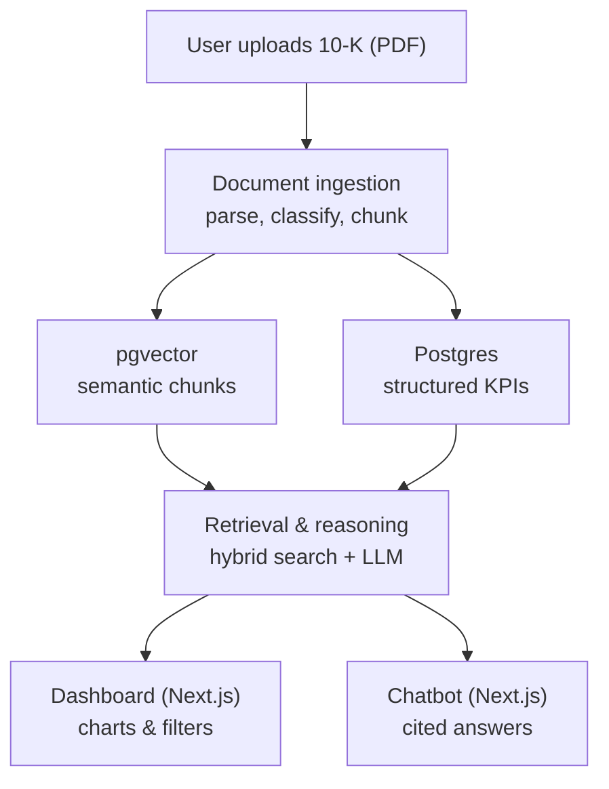

# Investor Intelligence Platform — Project Spec

> Living document. Update the tool/model tables as decisions change — this file is
> meant to be read by both humans and AI coding agents to understand what the
> system does and why specific choices were made.

Last updated: 2026-10-08

---

## 1. Problem statement

Reading a single 10-K/annual report end to end takes hours. Comparing two
companies means doing that twice and holding the differences in your head.
This project builds a tool that lets a user upload a company's financial
report and:

- get the key metrics pulled out and shown on a dashboard,
- ask free-form questions about the document (or compare it against another
  uploaded company) and get an answer grounded in the actual text, and
- always be able to click through from a claim/number to the exact page and
  paragraph it came from.

The last point is non-negotiable for this domain — an unciteable financial
number is not a usable financial number.

## 2. Goals / non-goals

**Goals (v1)**

- User uploads a text-based financial report PDF (`10-K`, `10-Q`, `20-F`) for a company.
- System validates PDF text layer (>= 200 chars) and classifies SEC form type prior to ingestion.
- System extracts core financial metrics via a single batched LLM call across primary statements with deterministic verification (verbatim grounding check, Python accounting equations, and post-verification unit scaling).
- Dashboard shows metrics with charts/tables and filters (company, year, metric).
- Chat agent answers questions about one company or compares several,
  grounded in the uploaded documents, with citations (file + page + section).
- Runs on free-tier tooling only — no paid service is required to run the
  system end to end, locally or hosted publicly.
- Buildable and deployable entirely in Python (backend) + React/Next.js
  (frontend), so it doubles as a portfolio/resume project.

**Non-goals (v1)**

- No automatic fetching of filings from the internet (SEC EDGAR, etc.) — the
  user supplies the document. (Worth revisiting later as a convenience
  feature, not part of the core loop.)
- No support for non-PDF or scanned image-only input formats (scanned image PDFs without text layer are rejected with HTTP 422).
- No multi-user auth/permissions system — single-user or trusted-group use
  assumed for v1.

## 3. User flow

1. User uploads a financial report PDF and (for v1) manually tags it with
   company name + fiscal year at upload time.
2. Pre-ingestion validator (`validate_upload`) checks text layer density (>= 200 chars)
   and verifies supported form type (`10-K`, `10-Q`, `20-F`), extracting fiscal year end date.
   Non-text or unsupported forms return HTTP 422 immediately.
3. Backend (FastAPI) parses the PDF via Docling into typed elements (headings,
   paragraphs, tables) with page numbers and section paths preserved.
4. Tables are filtered to primary financial statements (Operations, Balance Sheet, Cash Flows),
   extracted in ONE batched LLM call with unscaled printed values, verified verbatim,
   validated against accounting equations (`A = L + E`, `GP = Rev - COGS`), and unit-scaled in Python.
   Narrative text is chunked and embedded via `bge-small-en-v1.5`.
5. Extracted metrics land in Postgres (structured, with `verified` and `low_confidence` flags);
   chunks + embeddings land in the same Postgres instance via `pgvector` (semantic), each carrying
   company/year/page/section metadata.
6. Dashboard (Next.js frontend, calling the FastAPI backend) reads metrics —
   charts, tables, filters by company/year/metric.
7. User opens the chat agent, asks a question (single-company or
   cross-company). A router decides whether the question needs structured
   data, narrative retrieval, or both, retrieves accordingly, and the LLM
   (OpenRouter) answers with inline citations back to `{file, page, section}`.
8. User can click a citation to see the source excerpt (and ideally jump to
   that page of the original PDF).

## 4. High-level architecture



Two things worth calling out explicitly, since they're easy to get wrong:

- **The fork at ingestion is deliberate.** Tables/numbers go to Postgres as
  typed values; narrative text goes to pgvector as embeddings. Numbers
  should never be answered purely from vector search (embeddings are lossy
  over arithmetic) — see [ADR-1](#6-key-decisions--rationale).
- **Every stored fact carries provenance.** Both the metrics table and the
  chunk table must persist `source_file`, `page_number`, and `section_path`
  per record — this is what makes citations possible later. Retrofitting
  this after the fact means re-ingesting everything, so it's in scope from
  day one, not a v2 add-on.
- **Vector storage and structured storage now live in one database**
  (Postgres + `pgvector`), not two separate systems — see ADR-6.

## 5. Tech stack

Update this table as tools/models change — that's the point of it.

### 5.1 Core pipeline

| Layer | Component | Chosen tool | Alternatives considered | Status | Notes |
|---|---|---|---|---|---|
| Backend framework | API server | FastAPI (Python) | Spring Boot, Streamlit-only | Decided | Kept as a real API layer rather than folded into the UI — cleaner separation, better resume value |
| PDF parsing | Layout-aware parser | Docling | Unstructured.io, LlamaParse, Azure Doc Intelligence, AWS Textract | Decided | Local, free, typed elements + page numbers + table structure |
| Chunking (prose) | Structure-aware splitter | Markdown/heading-based splitter | Naive fixed-size, semantic (embedding-distance) chunker | Decided | Split on document structure first, size-cap second |
| Chunking (tables) | Whole-table chunks | Table serialized to Markdown/HTML per element | — | Decided | Never split a table mid-row; repeat header rows if a table must split |
| Embeddings | Text embedding model | `BAAI/bge-small-en-v1.5` (local, via `sentence-transformers`) | `bge-base-en-v1.5`, OpenRouter/hosted embeddings | Decided | Small variant chosen to fit comfortably in free-tier hosting RAM; runs identically in dev and prod (it's a library, not an API) |
| Vector store | Semantic chunk storage + hybrid search | `pgvector` extension, same Postgres instance as metrics | Qdrant (separate service), Chroma, Weaviate | Decided | One database instead of two; hybrid search = pgvector cosine + Postgres full-text (`tsvector`/`ts_rank`) combined in SQL |
| Reranker | Cross-encoder reranking | `BAAI/bge-reranker-base` (local) | Cohere Rerank (paid) | Decided | Reranks top-N hybrid results before they reach the LLM. Runs in the same backend process as the embedding model — Cloud Run's free-tier GiB-seconds comfortably cover both for a personal/demo project |
| Structured + vector storage host | Managed Postgres | Supabase (free tier) | Neon | Decided | Supabase bundles Postgres + `pgvector` + object storage (filings bucket). Uses Supavisor pooler (port 6543) for IPv4/async, and supports modern publishable/secret keys |
| LLM (reasoning/chat) | Generation model | OpenRouter free-tier models only, with a fallback chain across 2-3 `:free` models | Local Ollama fallback (rejected — see ADR-5) | Decided | See §5.2 for rate limits and model picks |
| Observability & Tracing | LLM & RAG Telemetry | Langfuse (Cloud Free Tier) | Phoenix, Helicone, Logfire | Decided | Free tier (50k traces/mo); tracks token usage (prompt/completion/total), latencies, model fallback events, and full RAG traces via `@observe` |
| Metric extraction | Structured output from LLM with deterministic verification | LLM + JSON schema (13 metrics) + Python verification | — | Decided | Primary statement filtering; ONE batched call with unscaled printed values; verbatim grounding check; Python accounting check retry; Python post-verification unit scaling |
| Frontend | Dashboard + chat UI | Next.js (React) | Plain React (Vite/CRA), Streamlit | Decided | Next.js chosen over plain React for free Vercel deployment ergonomics |
| Frontend hosting | Public deployment | Vercel (free tier) | Netlify, Cloudflare Pages | Proposed | Deploys directly from the GitHub repo, no cost at this scale |
| Backend hosting | Public deployment | Google Cloud Run (free tier) | Render (free tier, sleeps on inactivity), Fly.io | Decided | Free tier: 180,000 vCPU-seconds + 360,000 GiB-seconds + 2M requests/month, billed only while actively handling a request. Scales to zero when idle — comfortably covers local embedding + reranker models for a personal/demo project |

### 5.2 LLM: model choice and rate-limit strategy

| Item | Detail |
|---|---|
| Free tier shape | OpenRouter `:free` models: 20 requests/minute globally. Daily cap is 50/day if the account has never added credits, or 1,000/day once at least $10 has ever been added — that $10 isn't spent on free models, it just raises the ceiling |
| Recommended one-time action | Add $10 to the OpenRouter account once, to unlock the 1,000/day cap. Not an ongoing cost |
| Default model | `nvidia/nemotron-3.5-lightning:free` — Fast inference, strong structured-output handling |
| Fallback chain | 1. `google/gemma-4-31b-it:free`  2. `nvidia/nemotron-3-super-120b-a12b:free`  3. `openrouter/free` (OpenRouter's own auto-router — picks any currently-working free model matching required features; the safety net if all three named models are down) |
| Observability | All OpenRouter completions and fallback failovers are automatically captured in Langfuse with token usage, latency, and model provenance |
| Fallback strategy | On a 429 or 5xx, retry against the next model in the chain with exponential backoff, rather than failing the request. **Re-verify all IDs against `openrouter.ai/models` right before building ingestion** — free model IDs rotate weekly and get retired without much notice |
| Local fallback | None by design — see ADR-5. Local dev and hosted prod both hit OpenRouter only, so behavior is identical in both environments |

## 6. Key decisions & rationale (ADR-style)

**ADR-1 — Numbers never come from vector search alone.**
Embeddings are lossy over arithmetic; a dashboard built on vector-retrieved
numbers will eventually be quietly wrong. All quantitative metrics are
extracted once at ingestion, stored as typed values in Postgres, and read
directly by the dashboard. Vector search is reserved for narrative/"why"
questions and for anything not on the pre-extracted metric list.

**ADR-2 — Citations are provenance-first, not an afterthought.**
Every chunk and every extracted metric stores `source_file`, `page_number`,
and `section_path` at write time. This applies to both storage paths — a
number in Postgres needs to be traceable back to a page just as much as a
narrative claim does.

**ADR-3 — User uploads the document; the system does not fetch it.**
Core loop is manual upload + tagging (company, fiscal year) at v1.
Auto-fetching from SEC EDGAR or similar is a possible v2 convenience layer,
not part of the core mechanism.

**ADR-4 — Ratios are computed in code, never extracted or persisted from
the LLM.**
Gross margin, operating margin, net margin, free cash flow, debt-to-equity,
ROE, ROA, and YoY growth are all pure arithmetic on already-extracted raw
line items. Computing them in Python at query/render time costs zero extra
LLM calls and carries zero hallucination risk, versus asking the model to
do the math.

**ADR-5 — LLM generation runs on OpenRouter only; no local Ollama fallback.**
Chosen specifically so local development and public hosting hit the exact
same code path and provider — nothing to swap when moving from a dev
machine to production. Resilience against rate limits comes from a
fallback chain across multiple free `:free` models (§5.2) plus the one-time
$10 credit top-up, not from switching to a local model under load.

**ADR-6 — Vector storage consolidated into `pgvector` on the same Postgres
instance as structured metrics, rather than a separate Qdrant service.**
Minimizes the number of free-tier vendor accounts to manage, keeps chunk
metadata and metric data joinable in one database, and avoids syncing two
systems. Hybrid search is done via Postgres full-text search combined with
`pgvector` cosine similarity in a single query.

**ADR-7 — Pre-ingestion validation restricts v1 scope to text-based SEC filings.**
Uploaded documents are validated prior to ingestion (`validate_upload`):
- Scanned or image-only PDFs (< 200 chars across first 3 pages) are rejected immediately with HTTP 422.
- Form type must match supported forms (`10-K`, `10-Q`, `20-F`); unsupported forms (e.g. `40-F` or unknown) are rejected with HTTP 422.
- `form_type` determines the accounting standard alias map (US GAAP for `10-K`/`10-Q`, IFRS for `20-F`).

**ADR-8 — LLM-first metric extraction with deterministic verification.**
Instead of trusting free-form LLM arithmetic or running per-table loops:
1. Tables are filtered to primary financial statements (Operations, Balance Sheet, Cash Flows); all footnote/non-primary tables are pruned.
2. All primary statements are sent in ONE batched call to OpenRouter with unscaled printed values.
3. Every returned figure must appear verbatim in the source table text for its page (grounding check); ungrounded figures are marked `verified=False` and `low_confidence=True`.
4. Python enforces accounting equations (`Assets == Liabilities + Equity`, `Gross Profit == Revenue - COGS`). On failure, the failing statement is retried once. Persistent mismatches are stored with `low_confidence=True` rather than dropped silently.
5. Unit scaling (thousands/millions to base units) is applied in Python after verification, never by the LLM.

## 7. Data model (Postgres, high level)

| Table | Key columns | Notes |
|---|---|---|
| `documents` | `id`, `company`, `fiscal_year`, `form_type`, `fiscal_year_end`, `filename`, `upload_date`, `content_hash` | `content_hash` used for idempotent re-ingestion (upsert, not append); `form_type` sets US GAAP vs IFRS |
| `financial_metrics` | `id`, `document_id` (FK), `metric_name`, `value` (`NUMERIC`), `unit`, `currency`, `source_page`, `source_chunk_id`, `verified` (`BOOLEAN`), `low_confidence` (`BOOLEAN`) | One row per metric per document; unique on `(document_id, metric_name)`. Verified via verbatim grounding and accounting checks |
| `chunks` | `id`, `document_id` (FK), `page_number`, `section_path`, `element_type` (table/prose), `content`, `embedding` (`vector` via pgvector) | Content and embedding live in the same row/table now that storage is consolidated (ADR-6) |
| `chat_logs` *(recommended)* | `id`, `question`, `answer`, `retrieved_chunk_ids`, `created_at` | For debugging retrieval quality after the fact |

**`financial_metrics` schema:**

```sql
CREATE TABLE financial_metrics (
    id              SERIAL PRIMARY KEY,
    document_id     INTEGER REFERENCES documents(id) ON DELETE CASCADE,
    metric_name     TEXT NOT NULL,       -- 'total_revenue', 'net_income', ...
    value           NUMERIC NOT NULL,
    unit            TEXT NOT NULL,       -- 'USD_units', 'USD_millions'
    currency        TEXT NOT NULL DEFAULT 'USD',
    source_page     INTEGER NOT NULL,
    source_chunk_id TEXT,
    verified        BOOLEAN NOT NULL DEFAULT TRUE,
    low_confidence  BOOLEAN NOT NULL DEFAULT FALSE,
    UNIQUE (document_id, metric_name)
);
```

**v1 metric list — extracted via LLM (raw line items only):**

| Category | Metrics |
|---|---|
| Income statement | Total Revenue, Cost of Revenue, Gross Profit, Operating Expenses, Operating Income, Net Income, Diluted EPS |
| Balance sheet | Total Assets, Total Liabilities, Total Stockholders' Equity, Cash & Cash Equivalents |
| Cash flow | Operating Cash Flow, Capital Expenditures |

**Computed in application code (never persisted from LLM output — see ADR-4):**
Gross Margin %, Operating Margin %, Net Margin %, Free Cash Flow (`OCF − CapEx`),
Debt-to-Equity, ROE, ROA, and YoY growth on any of the above once 2+ years
exist for a company.

## 8. Retrieval & reasoning strategy

- **Query router**: classifies each question as needing structured data
  (Postgres), narrative retrieval (pgvector), or both. A "why is A
  underperforming B" question always triggers both, per company.
- **Comparison-aware retrieval**: multi-company questions run parallel,
  filtered retrievals per company rather than one blended query.
- **Hybrid search**: `pgvector` cosine similarity + Postgres full-text
  (`tsvector`/`ts_rank`) combined in one query, reranked before reaching the
  LLM — financial text is full of exact terms (tickers, GAAP line items)
  that pure dense retrieval misses.
- **Groundedness check**: a cheap post-generation pass verifying each claim
  in the answer traces back to a retrieved chunk, before showing it to the
  user.
- **Citation rendering**: LLM is required to reference chunk IDs in its
  answer; backend maps IDs back to `{file, page, section}` and renders
  "Source: <company> 10-K <year>, p.<page>" with the excerpt shown on
  request.

## 9. Non-functional requirements

- No paid service is required to run the system end to end, locally or
  hosted publicly (one optional $10 one-time OpenRouter credit top-up to
  raise the daily free-tier request cap — not an ongoing cost).
- Ingestion is idempotent — re-uploading the same document (by content hash)
  upserts rather than duplicates.
- Every user-facing number and claim must be traceable to a source
  file + page.
- Local dev and public hosting use the same providers end to end (OpenRouter
  for the LLM, same Postgres/pgvector instance) — no environment-specific
  code paths to maintain.
- "Local" model (embeddings, reranker) means in-process within the FastAPI
  backend, not tied to any specific machine — it runs wherever that backend
  is deployed (dev laptop today, Cloud Run container in production), with no
  separate step needed to move it. First request after a cold start pays a
  few seconds of model-load latency; subsequent requests on the same warm
  instance don't.

## 10. Roadmap

| Phase | Scope | Status |
|---|---|---|
| 1 | PDF upload, validation (10-K/10-Q/20-F), Docling parsing, table/prose fork | Completed |
| 2 | Chunk + embed narrative text into pgvector | Completed |
| 3 | Extract metrics with verbatim grounding & accounting verification | Completed |
| 4 | Dashboard (Next.js): charts, tables, filters | In progress |
| 5 | Chat agent: router + hybrid retrieval + citations | Backend completed |
| 6 | Groundedness check + eval set | In progress |
| 7 (later) | Auto-fetch from SEC EDGAR as a convenience option | Backlog |
| 8 (later) | Non-PDF input formats (scanned, HTML) | Backlog |

## 11. Open questions / TBD

- [ ] Whether to set Cloud Run `min-instances: 1` to avoid cold-start delay
      on the public demo, versus accepting the delay to stay fully within
      the always-free tier (min-instances keeps an instance warm 24/7, which
      is no longer "scale to zero" and can incur cost)
- [ ] Cloud Run region vs Supabase region — pick geographically close
      regions for both to minimize cross-service latency

## 12. Implementation defaults (resolved 2026-09-19)

These were flagged as inferred-but-unconfirmed during tracker generation.
Resolved here so they're no longer open questions for local development.
Deployment-stage items (hosting limits, CORS, container sizing, fonts/theme,
chart types) remain deferred until deployment is actually being worked on.

| Item | Default |
|---|---|
| Content hash algorithm | SHA-256 |
| DB indexes | GIN on `tsv_content` (full-text), HNSW on `embedding` (pgvector) |
| Chunk size / overlap | 300-600 tokens, 10% overlap — starting point, expect to tune |
| Embedding normalization | Normalized (matches `bge` model card recommendation) |
| Embedding dimension check | Assert 384-d at insert time (catches a wrong-model bug immediately) |
| Metric value cleaning | Parentheses `(1,234)` → negative; scale (thousands/millions) normalized to a consistent base unit at extraction time |
| Router intent taxonomy | `STRUCTURED` / `NARRATIVE` / `HYBRID` |
| Hybrid retrieval pool | Top-K = 20 candidates → reranked to top-N = 5 |
| **Citation delivery** | **Structured output** — LLM returns a `citations: [{chunk_id, page_number}]` field alongside the answer text, not an inline markdown convention. Inline formats are unreliable for a model to emit consistently every time; a schema field is validated the same way the rest of structured output already is |
| Response delivery | Buffered (non-streaming) for v1 — streaming is a later UX upgrade, not a v1 requirement |

## 13. Evaluation

Maintain a small hand-written eval set (target: 15-20 question/answer pairs
per company, with known correct numbers) to run after any change to
chunking, prompts, or retrieval logic. Not yet created — flagged here so it
isn't skipped once the pipeline exists.